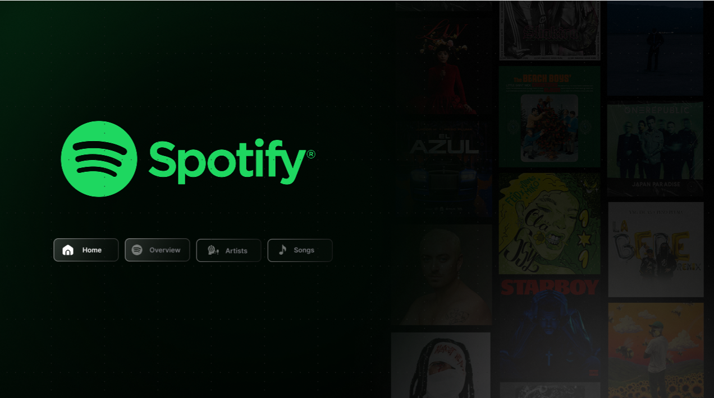
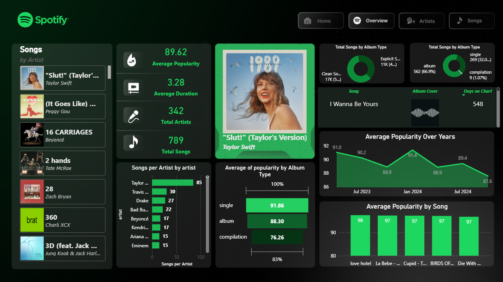
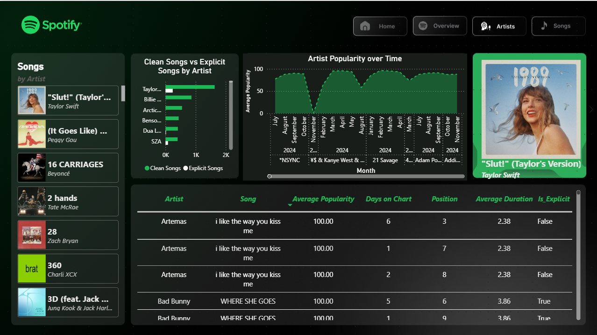
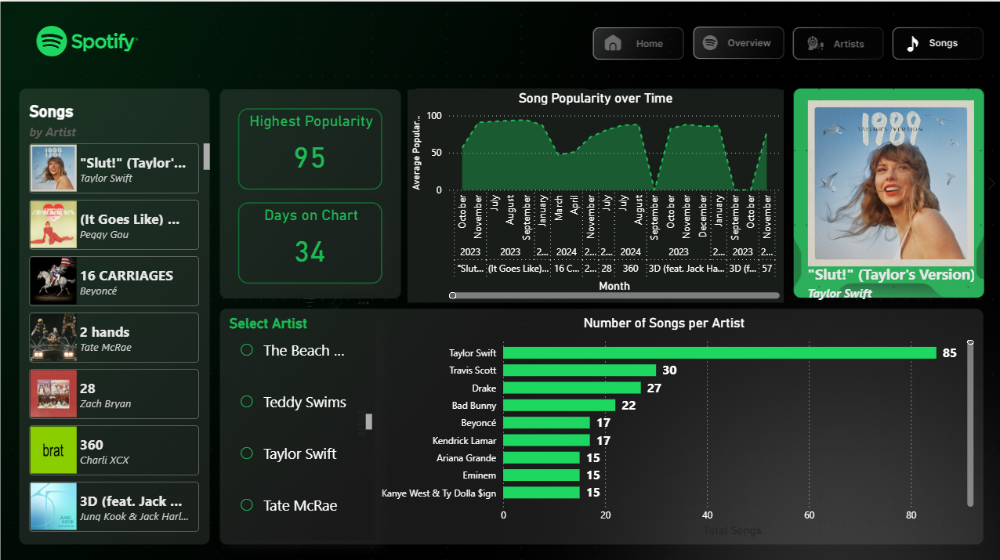

# Spotify Analytics Dashboard 

An interactive Power BI dashboard built to analyze Spotify music data. The project focuses on exploring artist performance, track characteristics, and listening trends through visual analytics.

---

### LinkedIn : [Spotify Dashboard Post](https://www.linkedin.com/posts/lavanya-mane-063860419_powerbi-dataanalytics-datavisualization-ugcPost-7485221372646924289-NH8n/?utm_source=share&utm_medium=member_desktop&rcm=ACoAAGphFksBnxr3vUvPFGbUkpTuM-s7PGXjr0c)

---

## Overview

This dashboard provides an interactive view of Spotify data, allowing users to explore:

- Track and artist performance
- Album-level insights
- Popularity trends
- Interactive filtering

The dashboard is designed to make large music datasets easier to explore through clear visualizations and user-friendly navigation.

---
## Dashboard Preview

### Home

The landing page provides navigation to different dashboard sections.

---

### Overview

A summary dashboard highlighting key metrics, album distribution, popularity trends, and overall Spotify insights.

---

### Artists

Analyze artist performance, popularity over time, and track-level details.

---

### Songs

Explore song popularity, chart performance, duration, and artist comparisons.

## Features

- Interactive slicers and filters
- KPI cards for key metrics
- Artist and album analysis
- Track popularity insights
- Audio feature visualization
- Clean and responsive dashboard layout

---

## Tools Used

- Power BI
- Power Query
- DAX
- Microsoft Excel / CSV Dataset

---

## Dataset

The dashboard is built using a Spotify music dataset containing information such as:

- Song Name
- Artist
- Album URL
- Album Name
- Album Type
- Popularity
- Position
- Total Track
- Release Date
- Days On Chart
- Duration

---

## Getting Started

1. Clone the repository.
2. Open `SPOTIFY DA.pbix` using Power BI Desktop.
3. Refresh the data if required.
4. Explore the dashboard using the available filters and slicers.

---

## Project Objective

The objective of this project is to demonstrate how Power BI can be used to transform raw Spotify data into meaningful visual insights through data modeling, DAX calculations, and interactive reporting.

